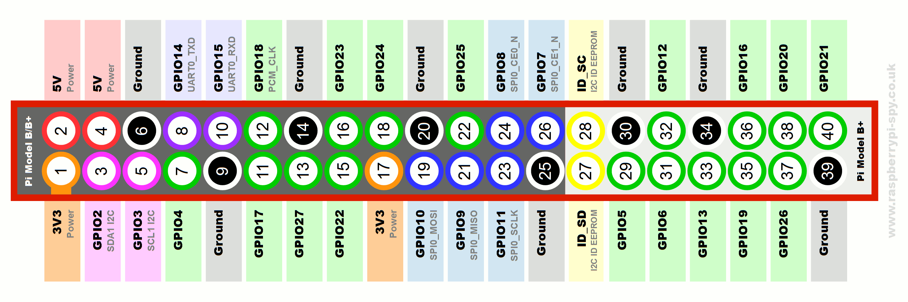

## MakeMIT 2020 Project: Internet Controlled Car

Pin Mapping:
Raspberry Pi GPIO Pin --> Motor Controller Output Pin
7 --> PWMA \\
11 --> AIN2 \\
12 --> AIN1 \\
13 --> STBY \\
15 --> BIN1 \\
16 --> BIN2 \\
18 --> PWMB
